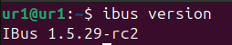
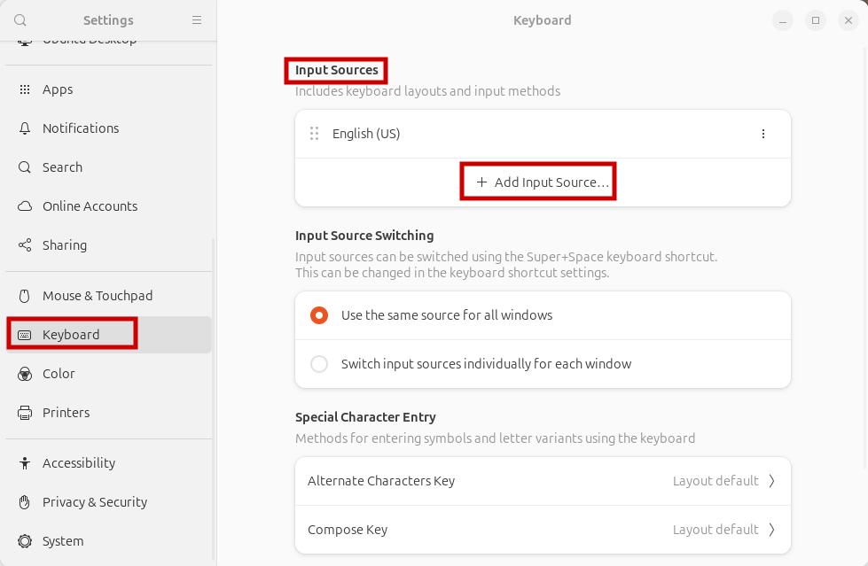
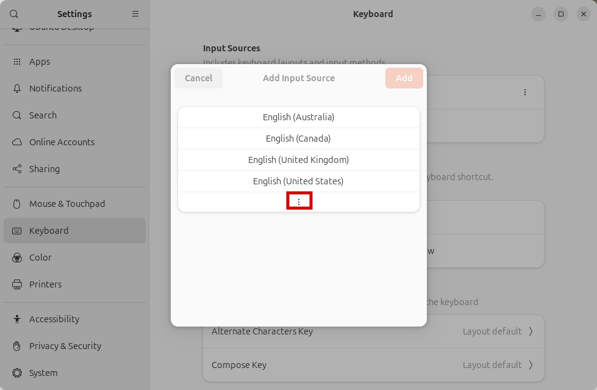
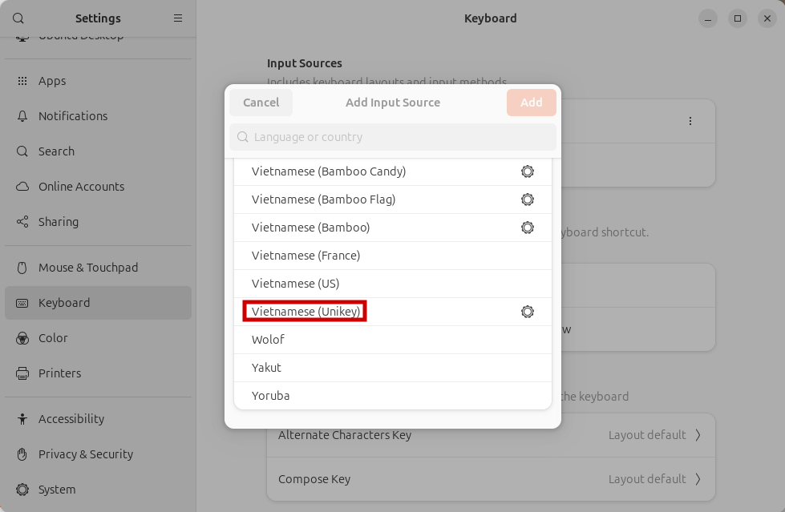
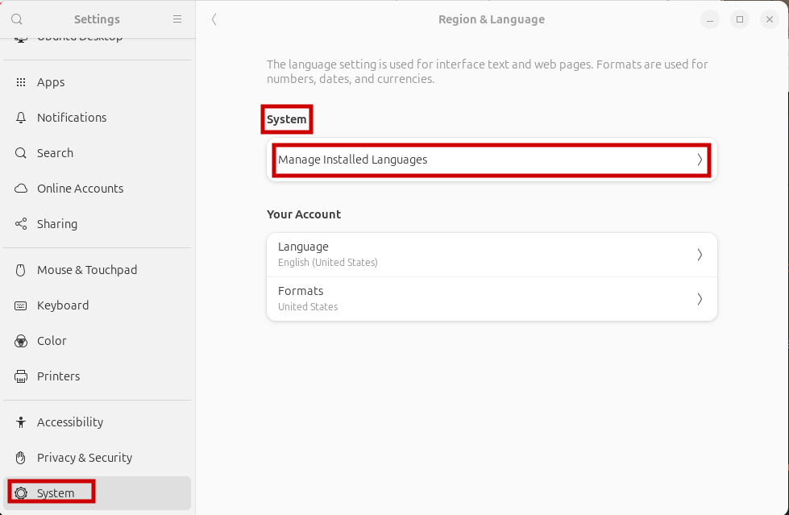
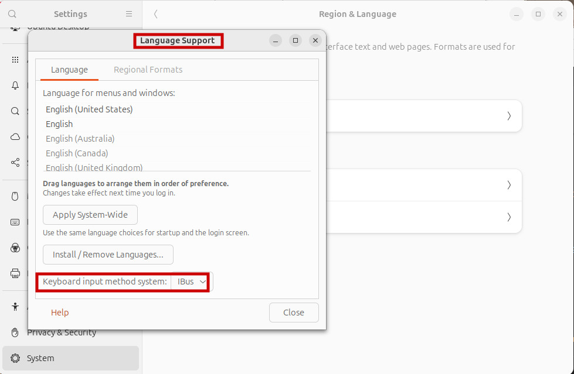
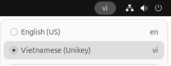

# Keybroad-ubuntu-unikey
Hướng Dẫn Cài Đặt Unikey Trên Ubuntu

## Cập nhật Ubuntu
```
sudo apt-get update && upgrade
```
 <span style="color: #CECC8C; font-weight: bold;">Bạn cần nhập mật khẩu khi sử dụng câu lệnh ở chế độ root (sudo)</span>


## Cài đặt ibus-unikey
### 1. Sử dụng câu lệnh sau để cài đặt ibus-unikey
```
sudo apt-get install ibus-unikey
```
### 2. Kiểm tra ibus-unikey đã được cài đặt thành công
```
ibus version
```
### 3. Cài đặt thành công



### 4. Khởi động lại máy
```
sudo reboot
```
 <span style="color: #CECC8C; font-weight: bold;">Câu lệnh này sẽ khởi động lại máy, hãy lưu các dữ liệu quan trọng trước khi thực hiện !!!</span>

## Cài đặt Unikey
### 1. Kiểm tra và chọn Unikey

Setting &#8594; Keyboard &#8594; Input Source &#8594; ⋮ &#8594; Other &#8594; Vietnamese (unikey) &#8594; Add





### 2. Cấu hình Ibus

Language Support &#8594; Keyboard input method system &#8594; Ibus &#8594; Close 





---
 <span style="color: green; font-weight: bold;"> Bạn đã cài đặt thành công Unikey !</span>